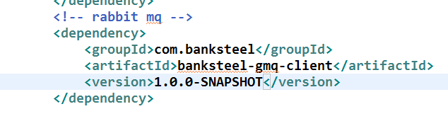
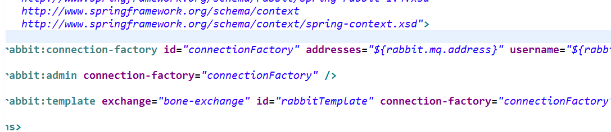
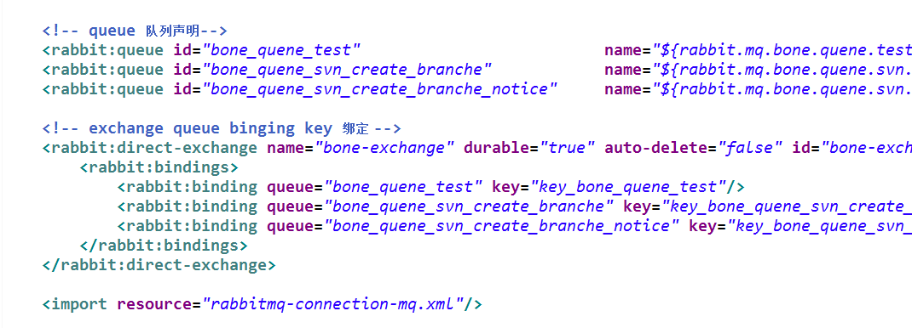
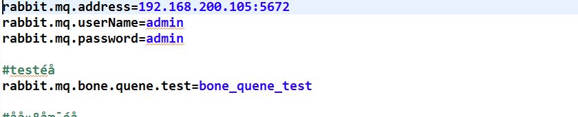
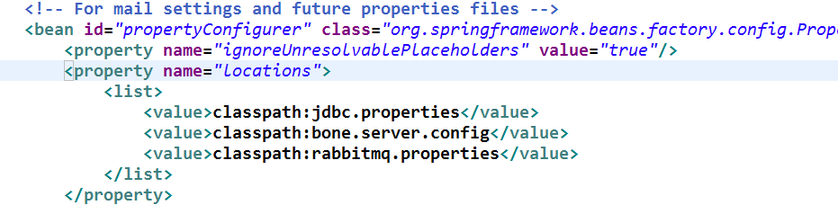
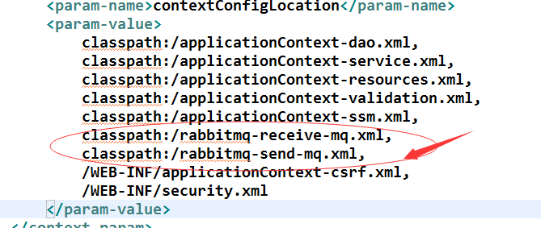
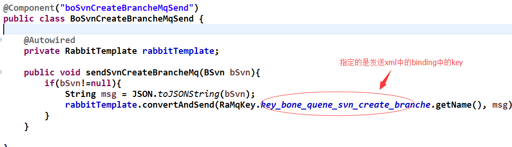
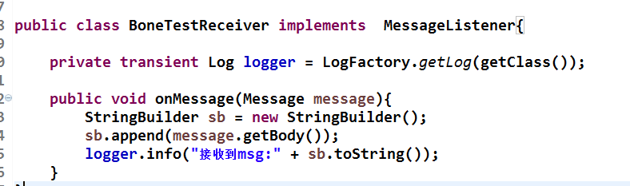
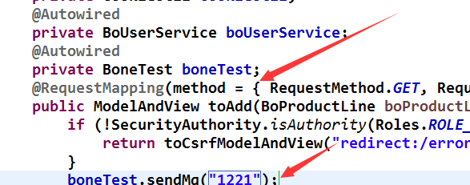

第一步:将需要的包加载进来，如有架包直接在pom文件中引用就可以，如:

第二步：配置相关的配置文件rabbitmq-connection-mq.xml 用于连接rabbitmq服务端 rabbitmq-receive-mq.xml监听接收消息，rabbitmq-send-mq.xml发送消息。。。
rabbitmq-connection-mq.xml:

rabbitmq-receive-mq.xml:

rabbitmq-send-mq.xml:

第三步：配置properties 。。连接rabbitmq rabbitmq.properties 

第四步：引用相关的properties和接收发的xml文件 Properties在applicationContext-resources.xml 中配置

接收发xml在web.xml中配置:

第五步 ：写发消息的方法:

第六步 ：写接收消息的方法:

第七步：controller 中引用方法:
